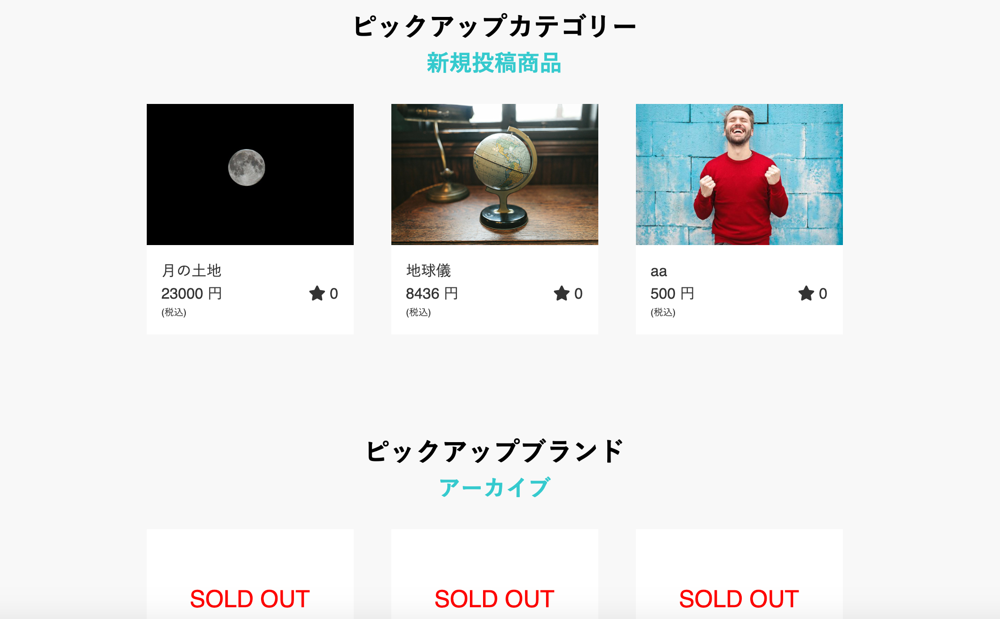

# README

## 概要
プログラミングスクールTECH CAMPの最終課題でフリーマーケットサイトを作成しました。約1ヶ月間、4人チームでアジャイル開発を行いました。

## 開発状況
- 開発環境

  - 開発言語：  
    - Ruby
  - フレームワーク:  
    - Ruby on Rails  
  - 開発ツール:  
    - Github/AWS/Visual Studio Code  
  - データベース：  
    - MySQL  

- 開発期間

  - 開発期間：  
    - 28日間(4/18 ~ 5/15 )  
  - 平均作業時間：  
    - 9時間/1日  

- 開発体制

  - 人数：  
    - 4人  
  - 開発方式：  
    - アジャイル型開発（スクラム）  
  - タスク管理：  
    - Trelloによるタスク管理  

- 動作概要  

  - 接続先情報  
  - URL:  
    - http://18.180.148.8/  
  - ID:  
    - admin  
  - Pass:  
    - 2222  

- inoshun1118の担当箇所

  - DB設計
    - 概要
      - 必要なテーブル、カラムの選定
      - アソシエーションの決定
    - 担当内容
      - ER図の作成
      - 各テーブルの作成
  
  - 出品商品一覧表示機能(バックエンド)

    - 概要
      - 出品された商品の表示
      - 購入された商品に「SOLD OUT」と表示
    - 担当内容
      - 出品された商品を新規投稿商品では新しいものから順に３つ、アーカイブでは古いものから順に３つ表示
      - 購入された商品に「SOLD OUT」と表示する機能実装

  - 商品購入確認画面(フロントエンド)

    - 概要
      - 商品購入確認画面の作成
    - 担当内容
      - haml,scssを使用しページのマークアップ作業

  - 出品機能実装(バックエンド)

    - 概要
      - 必須項目を入力しないと出品できないよう設定
    - 担当内容
      - バリデーション機能実装

## ER図

## users_table

|Column|Type|Options|
|------|----|-------|
|nickname|string|null: false, default: ""|
|email|string|null: false, unique: true, index: true, default: ""|
|encrypted_password|string|null: false, default: ""|
|reset_password_token|string||
|reset_password_sent_at|datetime||
|remember_created_at|datetime||
|user_image|string||
|introduction|text|
|family_name|string|null: false, default: ""|
|first_name|string|null: false, default: ""|
|family_name_kana|string|null: false, default: ""|
|first_name_kana|string|null: false, default: ""|
|birth_day|date|null: false|

### Association

- has_one :card
- has_one :destination
- has_many :products

## destination_table

|Column|Type|Options|
|------|----|-------|
|user|references|null: false, foreign_key: true, index: true|
|family_name|string|null: false|
|first_name|string|null: false|
|family_name_kana|string|null: false|
|first_name_kana|string|null: false|
|post_code|string|null: false|
|prefecture|string|null: false|
|city|string|null: false|
|address|string|null: false|
|building_name|string||
|phone_number|string||

### Association

- belongs_to :user, optional: true

## card_table

|Column|Type|Options|
|------|----|-------|
|user|references|null: false, foreign_key: true, index: true|
|customer_id|string|null: false|
|card_id|string|null: false|

### Association

- belongs_to :user

## category_table

|Column|Type|Options|
|------|----|-------|
|name|string|null: false|
|ancestry|string||

### Association

- has_many :products
- has_ancestry

## product_table

|Column|Type|Options|
|------|----|-------|
|name|string|null: false|
|price|string|null: false|
|description|string|null: false|
|status_id|integer|null: false, foreign_key: true|
|size_id|integer|null: false, foreign_key: true|
|shipping_cost_id|integer|null: false, foreign_key: true|
|shipping_days_id|integer|null: false, foreign_key: true|
|prefecture_id|integer|null: false, foreign_key: true|
|category_id|integer|null: false, foreign_key: true|
|brand_id|integer|foreign_key: true|
|shipping_id|integer|null: false, foreign_key: true|
|user_id|integer|null: false, foreign_key: true|
|buyer_id|integer|foreign_key: true|

### Association

- belongs_to :user
- belongs_to :category
- has_many :images, dependent: :destroy
- belongs_to_active_hash :size
- belongs_to_active_hash :status
- belongs_to_active_hash :shippingcost
- belongs_to_active_hash :prefecture
- belongs_to_active_hash :shippingdays
- belongs_to_active_hash :shipping

## image_table

|Column|Type|Options|
|------|----|-------|
|src|string|null: false|
|product|references|null: false, foreign_key: true|

### Association

- belongs_to :product
